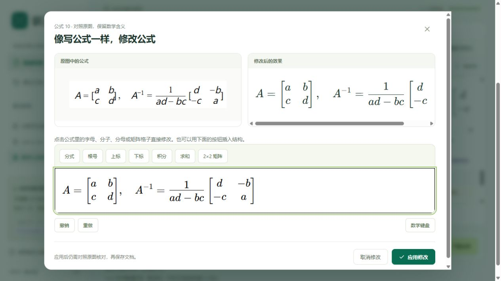
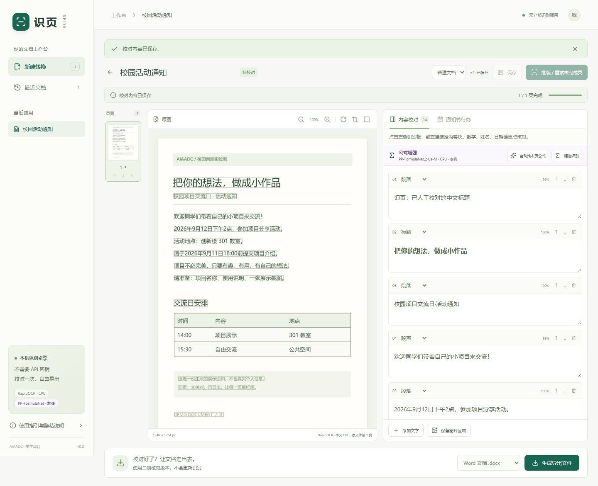
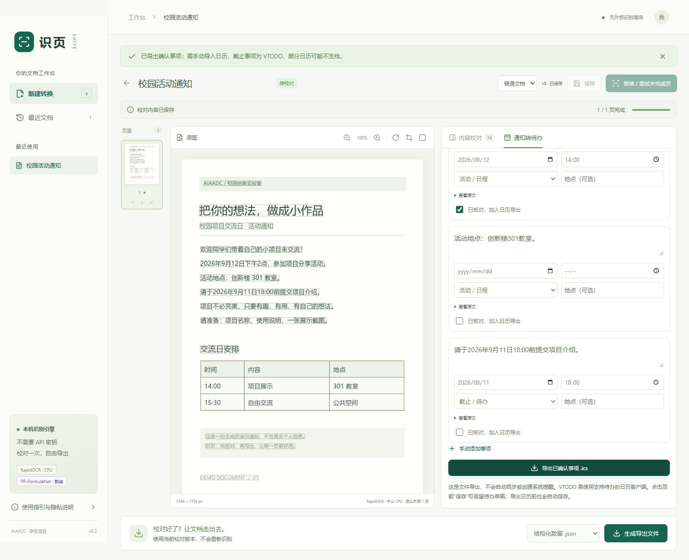

# 识页 Shiye

### 把图片，变成可用的文档。

一张群聊截图、一页课程讲义、一份带公式的论文——拖进来，识别文字与数学公式，逐块校对，再导出为真正可以编辑的文档。

**本机中文 OCR · 可视化公式校对 · Word / Markdown / PDF · 可选自带 API**


项目发起 / 维护：**[WenNinghan](https://github.com/WenNinghan)** · AIAADC 学生项目。

**[完整源码](https://github.com/WenNinghan/shiye) · [AIAADC 项目入口](https://github.com/AIAADC/student-projects/tree/main/projects/shiye-WenNinghan) · [反馈问题](https://github.com/WenNinghan/shiye/issues) · [发布状态](docs/release-status.md)**

当前为 **v0.3 桌面功能预览 / 源码发布版**：源码可按下方步骤在本机运行；Windows 安装版已完成本机内测，但安装包、模型权重暂不公开分发。**没有公网在线体验地址，也没有安卓/iPhone 安装包**；文中的 `127.0.0.1` 是你自己电脑的地址，不是作者提供的在线服务。

## 从这里开始

- 想先体验：看下方「先跑起来：Windows」，使用内置合成样例。
- 主要看论文、课本：[公式识别与可视化校对](docs/formula-guide.md)。
- 想了解桌面版 / 自己接 API：[桌面使用说明](docs/desktop-guide.md)。
- 想参与：[贡献指南](CONTRIBUTING.md)；想了解实际效果：[测试与限制](docs/desktop-acceptance.md)。
- 想了解许可与公开范围：[第三方来源与发布边界](THIRD_PARTY_NOTICES.md)。

## Windows 桌面测试版 v0.3

已新增独立桌面程序：默认本地识别，可导入公式离线包，也可自愿配置支持图片输入的 API。延用现有校对、数学公式显示和六格式导出。安装版用户无需自行配置 Python / Node。

先看 [桌面版使用说明](docs/desktop-guide.md) 和 [实际验收与限制](docs/desktop-acceptance.md)。安装版为未签名内测产物；真实第三方 API、干净 Windows 兼容性及再分发许可仍需补验。本仓库提供桌面源代码和构建脚本，**不是下载后双击源码就有桌面安装版**。下方启动方式运行的是同一校对工作台的本机浏览器版；API 设置目前只在桌面壳中启用。

### 公式不只是代码：看得懂，也改得动

识别后默认显示课本式公式。点「对照 / 放大」查看原图，点「修改公式」直接编辑分数、根号、上下标和矩阵；LaTeX 放在高级选项里。常见结构可导出 Word 原生公式，继续在 Word 中编辑。



截图是合成样例与人工校对流程，并非“模型识别全对”的证明。模型曾把矩阵中的 `a` 识别为 `d`，请始终对照原图。

## 可以用它做什么？

| 你手上的材料 | 你可以得到的结果 |
|---|---|
| 拍下来的讲义、截图 | 可编辑 Word、Markdown 笔记、纯文本 |
| 论文、课本中的清晰印刷公式 | 自动定位并转成可校对 LaTeX；导出 Markdown 数学块或 Word 可编辑公式 |
| 图片里的简单有线表格 | 可逐格校对的表格，导出到 Word / Markdown |
| 多张照片、扫描件 | 按选定页序合并的 PDF |
| 无法复制文字的扫描 PDF | 保留画面的可搜索 PDF |
| 群聊中的活动或作业通知 | 待确认事项、日期和时间，导出 `.ics` 日历文件 |
| 需要继续开发的识别结果 | 包含原始文字、校对文字、坐标和版本号的 JSON |

这不是把一整页图片塞进 Word。识别到的文字是段落，表格是可编辑单元格，支持的公式是 Word 原生数学对象；只有保留的插图区域才作为图片导出。

## 先跑起来：Windows

准备 **Python 3.12**（或 `uv`）和 **Node.js 22.12+ / 24**，然后双击根目录的 **`启动识页.cmd`**。

先获取项目：在 GitHub 点击 **Code → Download ZIP** 并完整解压；或使用 Git：

```powershell
git clone https://github.com/WenNinghan/shiye.git
cd shiye
./scripts/start.ps1
```

请不要从压缩包内部直接运行启动文件。若系统限制脚本执行，先查看本机安全策略，不要为运行项目关闭安全防护。

第一次运行会创建独立 `.venv`、安装依赖、构建网页。首次安装需要网络，OCR 运行时不调用外部 AI 服务。终端显示启动成功后，打开：

**[打开本机识页](http://127.0.0.1:8765)**

如需在 PowerShell 中指定 Python：

```powershell
./scripts/start.ps1 -Python 'C:/你的Python路径/python.exe'
```

安装完成后，跳过重复构建可以这样启动：

```powershell
./scripts/start.ps1 -SkipSetup
```

占用端口时可以换一个：`./scripts/start.ps1 -SkipSetup -Port 8766`。终端保持打开，按 **Ctrl+C** 停止服务。如果服务在后台运行，可执行 `./scripts/stop.ps1`；该脚本只停止本项目 Python 环境下的识页进程，保留文件数据。启动脚本不修改系统 Python，不保存 API 密钥。

### 可选：安装学术公式增强

普通文档模式安装完即可使用。要识别论文、课本中的印刷数学公式，再在项目根目录运行一次：

```powershell
./scripts/install-formula.ps1
```

脚本会建立一个与核心 OCR 隔离的 Python 环境，并下载 **PP-FormulaNet_plus-M** 公式模型和版面检测模型。建议预留约 4 GB；项目所在盘空间不足时，脚本会自动选择有足够空间的磁盘。安装与首次下载需要网络，完成后的识别在本机 CPU 运行，不上传图片，也不需要 API 密钥。安装后重启识页，首页“学术公式”应显示可选；也可访问 `/api/formula/status` 检查实际模型、设备和缓存状态。

本轮只验证了 Windows CPU 路线。公式环境较大，因此没有塞进默认 `.venv` 或源码 ZIP；不需要该能力的同学无需安装。详细说明见 [公式识别与校对指南](docs/formula-guide.md)。

macOS / Linux 提供 `sh scripts/start.sh`，但本轮尚未在这两个平台实测。Linux 还需系统库 `libgl1`、`libglib2.0-0` 和中文字体 `fonts-noto-cjk`；不要把脚本存在误认为已通过跨平台验收。

## 第一次使用：跟着做

### 1. 选择材料和格式

打开首页，点击“选择文件”，也可以拖入文件或在首页粘贴剪贴板中的截图。没有材料时，点击“用示例体验一下”。示例是程序生成的校园通知，不含真实个人信息。

- 输入：PNG、JPG、WebP、PDF。GIF、HEIC、Office 文件不在本版输入范围内。
- 单次最多 **20 页、50 MB**；单张图片最多 **3200 万像素**。
- PDF 页码可填 `1-3,5`，留空处理全部页。
- 多张图片组成一份文档；多份 PDF 默认独立导入。
- 需要将多个 PDF / 图片组合时，显式勾选“合为一份文档”。
- 当前浏览器会话最多同时保留 10 份文档；满额时请删除不需要的文件。

选择“普通文档”或“学术公式”，再点击“导入并整理”。普通模式更轻；学术模式会在正文 OCR 后自动定位页面中的印刷公式。选择的导出格式稍后仍可更换，不会额外跑一次 OCR。

### 2. 先整理原图，再识别



左侧缩略图用于选择页面、上下移动和移除页面。原图上方提供缩放、顺时针旋转、裁剪和遮盖：

1. **裁剪**：点击裁剪图标，在原图拖拽框选要保留的区域，点击“应用”。
2. **遮盖**：点击方块图标，框选姓名、电话号码等不希望保留的内容，再点击“应用”。这是黑色实心覆盖，不是可以撤销的预览层。
3. **旋转**：每次顺时针旋转 90 度。

图像操作会清除本页旧识别内容和旧导出，需要重新识别。已有内容时会再次提示确认。上传材料的原始文件请自行保留；应用只存储规范化后的页面，不提供原始文件下载。

### 3. 开始识别，逐块校对

点击“开始识别”。原生 PDF 优先提取现成文字；扫描件使用本机 RapidOCR 中文模型；学术模式随后使用隔离的 PP-FormulaNet 进程定位并识别公式。页面进度按真实完成页数显示，不使用虚假的识别百分比。

- 点击原图上的识别框，对应内容块会被选中并滚动到可见位置。
- 修改文字、切换标题 / 段落 / 列表 / 表格类型。
- 表格可逐格编辑，增加或删除末尾行、列。
- 使用“添加文字”在原图框选补充文字的位置。
- 使用“保留图片区域”框选图表或插图，导出时按框选区域裁切。
- 学术模式会自动加入“数学公式”块；也可点击“自动找本页公式”补扫，或点击“框选识别”后在原图上贴紧公式边缘拖框。
- 每个公式默认数学排版，点击“修改公式”可视化编辑；熟悉 LaTeX 的用户可展开高级选项修改源码。核对希腊字母、正负号、上下标、积分边界、括号和矩阵元素后，再勾选“已对照原图核对”。任何再次编辑都会自动取消确认。
- 支持调整内容块顺序、删除内容块、查看原始识别文字。
- 数字、姓名、日期和低把握提示应重点核对。框上的分数是 OCR 模型分数，**不是经过校准的正确率保证**。

点击顶部“保存”。导出前也会自动保存。页面修改有版本检查；发生冲突会阻止覆盖，重新加载前请保留自己尚未保存的文字。

识别中可以取消；再次开始只处理未完成页，已经完成和校对过的页面不重复识别。单页普通 OCR 超过 120 秒、公式任务超过 240 秒会失败并保留页面供重试。CPU 首次加载公式模型会明显慢于后续页面。

### 4. 生成并下载

在底部选择导出格式，点击“生成导出文件”，随后点击“下载文件”。

| 格式 | 行为与注意事项 |
|---|---|
| Word `.docx` | 清晰重排版，标题、段落、简单表格和支持的公式可编辑；公式写入原生 OMML。不是原版面逐像素复刻 |
| Markdown `.md` / `.zip` | 公式保留为 `$...$` / `$$...$$`；无图片时为 `.md`，有图片时为含 `document.md` 和 `assets/` 的 ZIP |
| 纯文本 `.txt` | 只保留文字；表格以制表符分列，分页用换页符分隔 |
| 图片 PDF | 无需 OCR，直接按页序合并图像；不会增加搜索文字 |
| 可搜索 PDF | 原图 + 当前校对版本的隐藏文字层。**修改文字不改变画面上的字** |
| JSON | 导出文档结构、来源、坐标、原始 / 校对文字、版本和保存的待办；目前不是一键恢复工程包 |

修改文档后，服务器会清理旧导出，避免下载过时结果。已经下载到电脑的文件不受影响。未完成页面的文字导出会给出警告；请勿忽略后把结果当成完整材料。

未勾选“已对照原图核对”的公式仍允许导出，但下载前会明确警告。少数自定义 LaTeX 宏或转换器不支持的结构无法转成 Word 数学对象时，识页会保留 LaTeX 源码并报告数量，不会静默丢内容。

### 5. 把通知变成待办



1. 先识别通知，在“通知转待办”页签设置**通知发出时的参考日期**，不是默认认为截图中的“明天”就是今天的明天。
2. 点击“从整份文档提取候选事项”。本版使用关键词和日期规则，不调用语言模型。
3. 核对标题、日期、时间，补充地点，选择“活动 / 日程”或“截止 / 待办”。
4. 勾选“已核对”。修改事项后必须重新确认；没有明确时间时不会补成 23:59。
5. 点击“导出已确认事项 .ics”，再手动导入自己的日历。顶部“保存”可保留草稿，导出日历也会先保存。

时间按北京时间 **UTC+8** 解释；日程用 `VEVENT`，截止事项用 `VTODO`。部分日历不支持 VTODO，因此导入前请确认客户端能力。**文件导出不等于已建立系统提醒，更不等于自动同步日历。**

修改源文字会清空前端候选事项，图像变换、重新识别也会清空已提取的待办，避免拿旧内容当新结果。

## 数据与隐私

- 当前默认只监听 `127.0.0.1`，不发布公网网站。
- 文件上传到运行识页的机器处理。本机启动就留在本机；自行部署到远程机器后，文件会发送到该机器，不能继续理解为“浏览器纯离线处理”。
- 前端不加载外部字体、统计脚本或第三方识别 SDK。
- RapidOCR、PP-FormulaNet 和 KaTeX 都在运行识页的机器上工作；公式子进程只读取应用生成的本地页面图像。
- 源码版数据位于项目专用 `.data/`，或者环境变量 `SHIYE_DATA_DIR` 指定的目录；桌面版放在当前用户的应用数据目录。两者不自动迁移文档。
- 每份文档从上传起保留 **24 小时**。服务运行时约每分钟清理过期数据；服务关闭时没有后台清理进程，下一次启动才继续清理。过期资源立即拒绝访问。
- 当前浏览器 Cookie 是会话凭证。另一会话不能通过猜链接读取原图、文档或导出。清除 Cookie 后也无法恢复本会话的访问权。
- “彻底删除”是删除本应用中的页面文件、数据库记录、导出及待办，不能撤销；**不承诺磁盘取证级擦除**，也无法删除你已下载的文件、系统备份或第三方备份。
- 未开启账户注册、团队共享和跨设备同步。桌面版可选用户自己的 API：确认目标服务和发送页后才外发图片，费用由用户与服务商结算；默认本地识别无需密钥。

本版适合本机单用户 / 小范围可信试用。**不要直接把本机启动命令换成公网监听就当成生产服务**：账户与登录、限流、文件扫描、PDF 解码资源隔离、全局存储配额、HTTPS、审计和备份策略尚未完成。OCR 已有独立进程和超时限制，但上传阶段的 PDF 解码仍在服务线程中执行。

## 实现结构

```text
图片 / PDF
  → 校验、规范化为页面图像
  → 原生 PDF 文字提取 / RapidOCR 正文与简单表格
  → 可选 PP-DocLayout + PP-FormulaNet：整页定位或框选公式 → LaTeX
  → DocumentIR：页面、文字 / 表格 / 图片 / 公式块、坐标、校对状态、版本
  → 校对保存
  → DOCX（含 OMML）/ Markdown / TXT / PDF / JSON / 待办日历
```

```text
shiye/
├── backend/shiye/        # FastAPI、SQLite、逐页 worker、OCR 和导出器
├── backend/tests/       # 单元 / API / 真实 OCR 测试
├── web/src/             # React + TypeScript 校对工作台
├── web/e2e/             # 浏览器完整流程测试
├── web/public/examples/ # 可复现的合成演示输入
├── desktop/             # Electron、API 设置、系统加密和模型包导入
├── packaging/           # 独立 Python 核心与公式引擎的构建配置
├── scripts/             # 一键启动、可选公式安装、样例、验收、源码打包
├── docs/                # 使用说明、设计、验收、发布状态与后续路线
├── verification/        # 实际浏览器截图和导出检查结果
├── Dockerfile           # 可部署骨架，本轮未执行镜像构建
└── 启动识页.cmd
```

采用 **React + TypeScript + Vite + KaTeX / FastAPI / SQLite / RapidOCR + ONNX Runtime / PaddleOCR PP-FormulaNet / PyMuPDF / python-docx + OMML**。公式引擎使用独立长驻子进程，避免 Paddle 与核心 OCR 依赖相互污染。前端构建后由 FastAPI 同源提供，无需同时维持额外 Node 服务。持久任务状态和待办直接存在版本化文档记录中，导出另表索引。

开发时先启动 Python 服务，再在 `web/` 运行 `npm run dev`。Vite 将 `/api` 转发到本机 8765 端口。API 文档在 [本机接口说明](http://127.0.0.1:8765/api/docs)。

### 验证命令

```powershell
# 在项目根目录，使用项目 Python 环境
uv pip install --python .venv/Scripts/python.exe -e './backend[test]'
./.venv/Scripts/python.exe scripts/make_samples.py
Push-Location backend
../.venv/Scripts/python.exe -m pytest -q
Pop-Location

# 先确保另一个终端已经启动 8765 服务
Push-Location web
npm ci
npx playwright install chromium
npm run build
npm run test:e2e
Pop-Location

# 已安装可选公式环境时，跑真实积分、整页定位和原生 Word 公式检查
./.venv/Scripts/python.exe scripts/verify_formula.py
```

真实结果与覆盖范围见 [验收记录](docs/acceptance.md)，尚未完成的专业能力见 [后续路线](docs/roadmap.md)。没有采集完成 60 份真实文档测试集，因此不宣称达到某个总体准确率，也不把合成样例通过当成真实用户试用通过。

## 已知能力边界

- 优先支持清晰印刷中文 / 英文、简单有线表格和清晰印刷数学公式。
- 手写、弯曲书页、严重透视、复杂多栏、合并单元格、无框线表格、模糊或过长公式仍可能需要手动整理。
- 图片 OCR 基本以行框输出，跨行段落并未自动智能合并。
- 公式模型会犯符号级错误；真实验收中，矩阵末项曾把 `a` 识别为 `d`。模型分数不是公式正确率，不能跳过原图核对。
- 常见分式、根式、上下标、积分和矩阵已实测可导出为 Word 原生公式；冷门宏包、自定义命令和复杂分段结构可能回退为 LaTeX 源码。
- 图片区域可手动框选；没有假装已经接入专业图表 / 版面识别模型。
- 本轮没有实测 Docker、Linux/macOS、多浏览器、屏幕阅读器、恶意文档或高并发场景。
- 日历规则不保证跨行上下文关联、地点语义提取、任意日期表达或时区换算；请逐条确认。

## 依赖与发布许可

识页自有源码及随附文档采用 **[MIT License](LICENSE)**，版权署名为 **Copyright (c) 2026 WenNinghan**。按许可证条件保留版权与许可声明，即可使用、复制、修改和分发这些自有内容。

MIT 不改变第三方依赖、模型权重、字体和其他上游素材的许可证。识页复用了 [RapidOCR](https://github.com/RapidAI/RapidOCR) 和 [PaddleOCR](https://github.com/PaddlePaddle/PaddleOCR)；其中 PyMuPDF / MuPDF 使用 **AGPL 与商业许可双授权**，详见 [官方许可说明](https://pymupdf.readthedocs.io/en/latest/about.html#license-and-copyright)。本项目选用 MIT 不表示包含这些组件的完整安装包或服务也可仅按 MIT 分发；打包、部署与再分发仍需履行适用的第三方许可义务。

## 想一起把它做好？

欢迎带着一个具体的问题参与：一张识别失败的脱敏截图、一段更清晰的说明、一个表格恢复改进，都是有价值的贡献。

提交问题时尽量附上：**输入类型 → 操作步骤 → 期待结果 → 实际结果 → 已脱敏样例**。不要上传学生证、身份证、手机号、Token 或未经同意的群聊截图。

下一份好用的小工具，也可以从你遇到的一件麻烦事开始。
